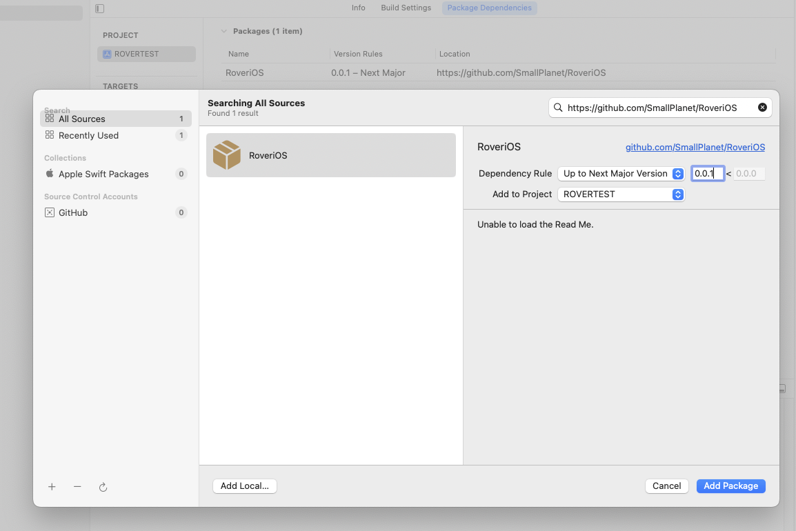
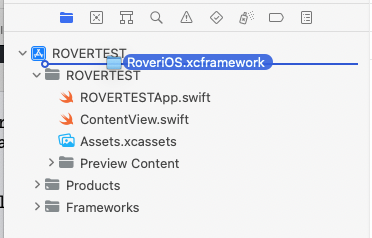
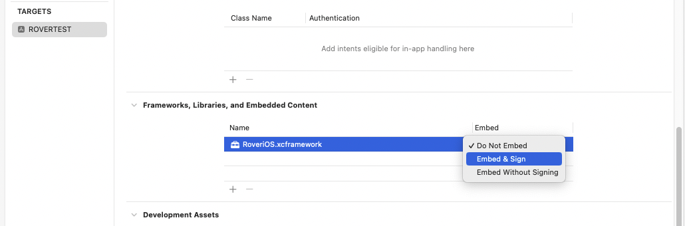

## Usage

```swift
// To interact with a Rover collector you provide a RoverDelegate. A minimal
// delegate would know when the collection is finished (either successfully or
// as a result of an error) and be able to process any receipts collected.
//
// IMPORTANT NOTE: Some delegate methods provide a callback. Collection will not continue
// until the callback is made.
class ReferenceDelegate: RoverDelegate, ObservableObject {
    override func roverDidFinish(sessionUUID: String,
	                              resultsGzip: Data,
	                              error: String?,
	                              userError: String?,
                                 verboseError: String?) {
        if let error = error {
            print("RoverDelegate: [\(sessionUUID)] finished with error: \(error)")
        } else {
            print("RoverDelegate: [\(sessionUUID)] finished")
        }
    }
    override func roverDidCollect(sessionUUID: String,
                                  receipts: [Receipt]) {
        // Receipts will be passed to you in batches during the collection process
        print("RoverDelegate: [\(sessionUUID)] captured \(receipts.count) receipts")
    }
}
```

```swift

// Note: You will need to call configure to provide your license key
// and receive the list of merchants you will be able to collect from.
// Each merchant will be an int identifier and a user facing name
// You may call configure multiple times if you wish.
Rover.shared.configure(licenseKey: "MY_ROVER_LICENSE_KEY") { merchants, error in
	// merchants is an array of merchants your license is enabled to connect to
	// each merchant contains user facing name, logo, and merchant id
}

// When you are ready to connect and collect from a merchant, call 
// Rover.collect() with the desired merchant id, the date back to
// which Rover should collect from, and your delegate instance
// to collect the results with
let date = Date(timeIntervalSinceNow: -60*60*24*365*1)

// 1. Create a new connection to a merchant
// userId: [optional] identifier you provide and passed through by Rover
// account: [optional] account name for this merchant to connect to (nil for new connection)
// merchantId: the identifier for the merchant to connect to (passed back in configure merchants array)
// fromDate: how far back you'd like to collect receipts
// collectItemInfo: [optional] collect extra information about items when possible (like UPC)
// isEphemeral: [optional] encrypt and store this connection locally to reconnect at later date
// note: see header for full list of parameters
Rover.shared.collect(userId: nil,
                     account: nil,
                     merchantId: merchantId,
                     fromDate: date,
                     collectItemInfo: true,
                     isEphemeral: false,
                     delegate: delegate)

// 2. List current merchant connections
// connections: array of existing merchant connections
Rover.shared.connections { connections in
	
}

// 3. Recollect from an existing connection
Rover.shared.collect(userId: nil,
                     account: connection.account,
                     merchantId: merchantId,
                     fromDate: connection.fromDate,
                     collectItemInfo: true,
                     isEphemeral: false,
                     delegate: delegate)

// 4. Remove a connection
Rover.shared.remove(connection: connection) { }

```

### Background Collection

To perform collections in the background (via [BGTaskScheduler](https://developer.apple.com/documentation/uikit/using-background-tasks-to-update-your-app?language=objc)) you need to perform the following steps.

- Add the **Background Modes** signing capability to your application;  enable the **Background fetch** and **Background processing** options.  
- Add **Permitted background task scheduler identifiers** to your Info.plist; add **com.smallplanet.rover.processing** as a permitted identifier.
- In your app's applicationDidFinishLaunching method you must call **Rover.shared.scheduleBackgroundCollections()**

```
func application(_ application: UIApplication,
                 didFinishLaunchingWithOptions launchOptions: [UIApplication.LaunchOptionsKey : Any]? = nil) -> Bool {
	// Schedule background refreshes at most every 24 hours.
	// You can pass an interval of 0 to cancel scheduled tasks and disable.
	// You must call Rover.shared.scheduleBackgroundCollections() at least once in
	// didFinishLaunchingWithOptions; you may call it any time after to update
	// the schedule interval
	Rover.shared.scheduleBackgroundCollections(interval: 60 * 60 * 24) {
		// When iOS chooses to allow for background processing this code will run.
		// You should call Rover.shared.collect() for the connections you would like to refresh.
		// This allows you to implement custom logic to fit your business needs (for example, 
		// if one connection is higher priority than another or needs to be refreshed more
		// often than another). Note that the amount of time allowed to collections is
		// typically limited to a few minutes.
        Rover.shared.configure(licenseKey: "MY_ROVER_LICENSE_KEY") { merchants, error in
            Rover.shared.connections { connections in
                
                // Perform collections for at more one connection; that connection should:
                // - not be userInteractionRequired
                // - have the oldest collection date
                let filteredConnections = connections
                    .filter { $0.userInteractionRequired == false }
                    .sorted { lhs, rhs in
                        return (lhs.attemptedDate ?? Date.distantPast) < (rhs.attemptedDate ?? Date.distantPast)
                }
                if let connection = filteredConnections.first {
                    Rover.shared.collect(account: connection.account,
                             			merchantId: connection.merchantId,
                             			fromDate: connection.fromDate ?? Date(),
                             			isEphemeral: false,
                             			featureFlags: connection.featureFlags,
                             			delegate: ReferenceDelegate())
                }
            }
        }
	} collectionWillFinish: { taskIdentifier, connections in
		// Called before background collection finishes (either because it was
		// fuly completed or because iOS ended it early). Connections contains
		// the connections which completed during the run.
	}
}
```


## SDK Integration

### Swift Package Manager

To use Rover As a Swift Package Manager dependency simply add it to the dependencies section of your Package.swift and as a dependency to the specific target.

```swift
dependencies: [
    .package(url: "https://github.com/SmallPlanet/RoveriOS.git", from: "0.0.1")
]
...
.target(
	...
	dependencies: [
		"RoveriOS"
	]
)
```

### Xcode - Swift Package Manager

To add a new package dependency to your Xcode project, select your Xcode project, choose **Package Dependencies** and click the "+" button. Enter in the repository URL ( https://github.com/SmallPlanet/RoveriOS ) into "Enter Package URL" field. Set dependecy rule to "Up to Next Major Version" and enter an appriopriate version number. Click **Add Package** to complete the addition.



### XCFramework

RoveriOS is distributed as an XCFramework, which is located in the root of this repository as RoveriOS.xcframework.zip. You can manually add this XCFramework to an existing Xcode project by downloading and expanding RoveriOS.xcframework.zip. Take the resulting **RoveriOS.xcframework** and drag it into your Xcode project.



Clear the following dialog and then go to your target's General settings.  In the **Frameworks, Libraries, and Embedded Content** section ensure **RoveriOS.xcframework** is present and it is set to **Embed & Sign**




Latest version: v0.4.35
